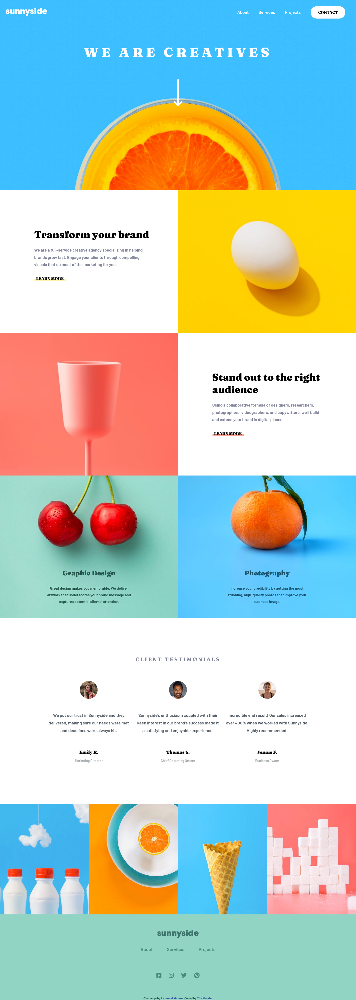
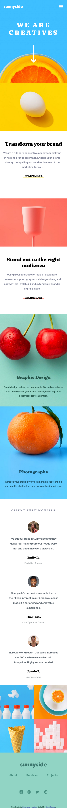

# Frontend Mentor - Sunnyside agency landing page solution

This is a solution to the [Sunnyside agency landing page challenge on Frontend Mentor](https://www.frontendmentor.io/challenges/sunnyside-agency-landing-page-7yVs3B6ef). Frontend Mentor challenges help you improve your coding skills by building realistic projects.

## Table of contents

- [Overview](#overview)
  - [The challenge](#the-challenge)
  - [Screenshot](#screenshot)
  - [Links](#links)
- [My process](#my-process)
  - [Built with](#built-with)
  - [What I learned](#what-i-learned)
  - [Continued development](#continued-development)
  - [Useful resources](#useful-resources)
- [Author](#author)

## Overview

### The challenge

Users should be able to:

- View the optimal layout for the site depending on their device's screen size
- See hover states for all interactive elements on the page

### Desktop Screenshot

### Mobile Screenshot

### Links

- Solution URL: [Add solution URL here](https://your-solution-url.com)
- Live Site URL: [Github pages](https://timmartin13-frontend-mentor.github.io/sunnyside_agency/)

## My process

I started with the navbar and the hero image, then worked my way down the page section by section. Having worked with the mobile first workflow for awhile, I tried to do the desktop version to this challenge first this time. I think that may have made it a bit harder but it seems to have turned out fine in the end.

### Built with

- Semantic HTML5 markup
- CSS custom properties
- Flexbox
- SCSS
- HTML

### What I learned

I learned that a mobile first workflow is usually the easiest way to do things. As I do more of these projects, I learn a little more about SCSS syntax and how to arrage the various fonts, colors, etc... I also added a little more animation to the hamburger menu to add a little flare to the project.

### Continued development

I want to continue to learn more about SCSS and the best practices for using it. I also want to start doing more JavaScript so that I can start using my programming background.

## Author

- Website - [My portfolio](https://timmartin13.github.io/react-portfolio/)
- Frontend Mentor - [@TimMartin13](https://www.frontendmentor.io/profile/TimMartin13)

